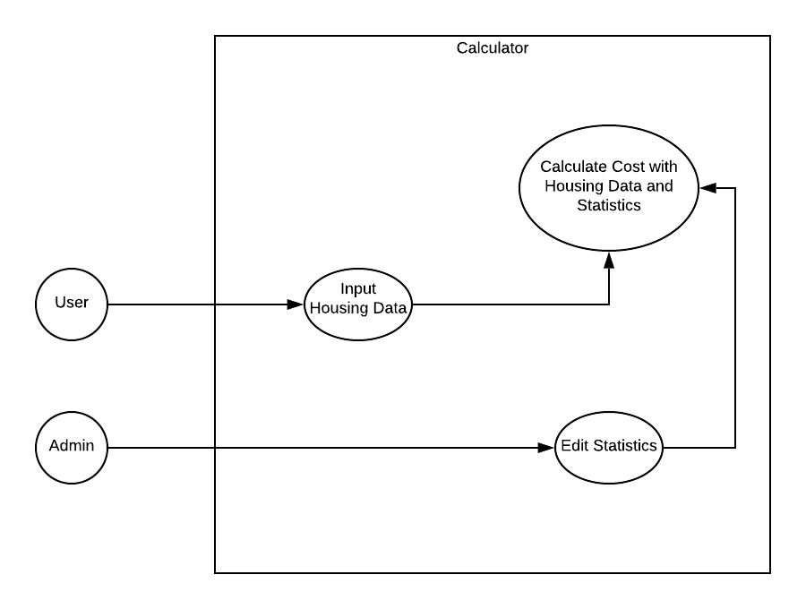

# Solar Calculator
## Project Abstract

The project I propose is a stand alone project. The prokect would be a calculator specifically designed to estimate how much it would cost to have a solar panel system installed in the users home. The calculator would take specific information from the user and use up to date statistics of parchasing and installation costs to give the user a personalized estimation. Potential information the user would input would be KWH usage per day, or square footage of home, location of home, and the percentage of their electric bill they would want covered by the system (desired coverage). 

## Project Relevance

The project would heavily involve using object oriented programming and parallel computing. For instance, object oriented programming would be used during the process of factoring in the homes location. Multiple calculations will need to be done simultaneously to determine whether or not a power storage system would be worth it which would incorperate parallel computing.  

## Proposed Contribution.
Since this is a stand alone project, our groups contributions will be the project in its entirety. My individual contributions will be gathering all of the real world statistics needed, and figuring out the specifics of how all of that data will be used to calculate the estimation. The specifics of how the code will be divided up amongst the group would be carried out during the projects creation. 

## A URL reference to the project.
No link currently available. 

